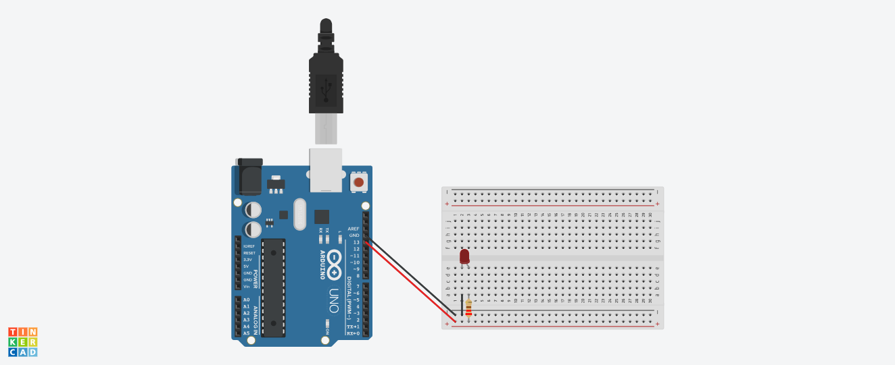

# Projeto Arduino (Cat Rocks1) - Tinkercad

💡 **Descrição:**
Primeiro exercício desenvolvido no **Tinkercad** com **Arduino**, intitulado **Cat Rocks1**. Ele faz uma luz (LED) piscar alternadamente: acende por 1 segundo, apaga por 1 segundo, repetidamente.
Projeto realizado durante o **2º semestre da faculdade (2023/2)**, como parte das aulas práticas.
Ficou um tempo guardado até eu finalmente decidir postar este e outros exercícios feitos com Arduino. 🚀

---

## 📂 Conteúdo do Projeto

- `cat_rocks1_21.ino` → Código-fonte do Arduino
- `circuito.png` → Imagem do circuito criado no Tinkercad

---

## 📸 Circuito

---

## 📝 Licença

📖 Projeto livre para fins de estudo e aprendizado.
Sinta-se à vontade para usar como referência ou base para seus próprios testes!
